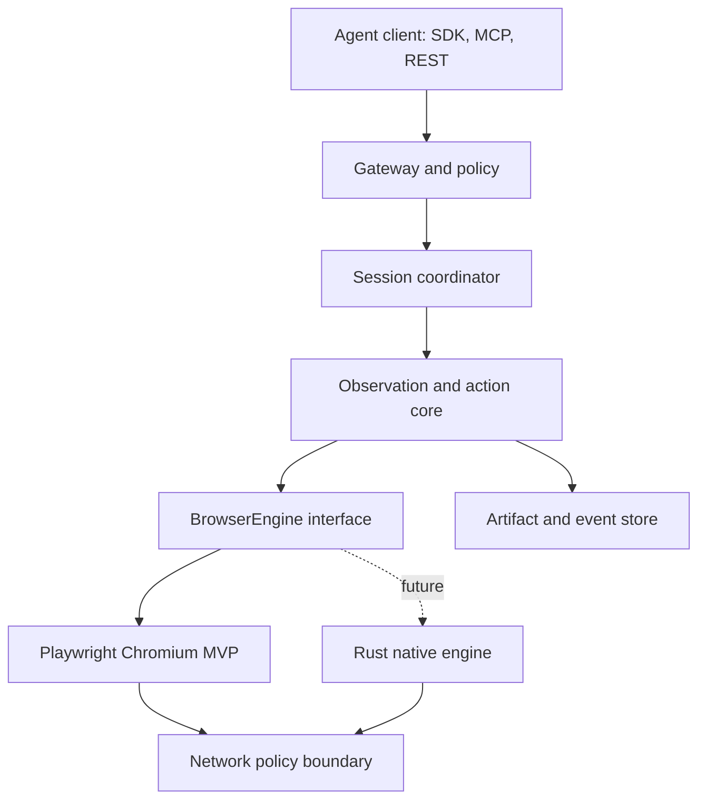

# AgentBrowser: Agent-First Headless Browser

**Implementation specification v1.0**  
**Status:** Ready for Codex/Claude implementation  
**Primary implementation:** TypeScript on Node.js with Playwright and Chromium  
**Future engine:** Rust, exposed through the same engine-neutral contract  
**Default mode:** Headless  
**License recommendation:** Apache-2.0

---

## 1. Executive decision

Build **AgentBrowser** as an agent-native browser service, not as a new rendering engine in the MVP.

The MVP should use:

- **TypeScript** for the public API, agent action model, session orchestration, policy enforcement, observations, SDK, and MCP server.
- **Playwright + Chromium** as the first browser backend because it gives immediate real-web compatibility, mature auto-waiting, isolation primitives, tracing, downloads, screenshots, accessibility information, and a high-quality TypeScript API.
- A strict **`BrowserEngine` adapter boundary** from the first commit. The MVP backend is `PlaywrightChromiumEngine`; later backends can be `RemoteCdpEngine`, `ObscuraEngine`, and ultimately `AgentBrowserRustEngine`.
- **Headless operation by default**. A headed local debug mode is allowed, but no human browser chrome, tabs UI, extensions, bookmarks, synchronization, or pixel-perfect interactive UI belong in the product.

Do **not** begin by writing a browser engine from scratch. That would make HTML, DOM, CSS, JavaScript, networking, layout, painting, accessibility, and CDP conformance the MVP rather than the agent product. First validate the agent-facing abstraction, safety model, token efficiency, reliability, and economics on Chromium. Only replace Chromium where measurements prove it is the bottleneck.

The long-term architecture should still follow the strongest Kitesurf ideas:

1. Agent-readable output is more important than human-facing browser chrome.
2. Every navigation target is hostile input.
3. All network access passes through one enforceable policy boundary.
4. State is ephemeral unless explicitly persisted.
5. Renderers and workers are disposable.
6. Failures degrade a page or action, not the entire service.
7. Compatibility is established by tests, not claims.
8. The control protocol remains stable while engines evolve.

## 2. Why this language and architecture

### 2.1 Decision matrix

| Choice | Strength | Weakness | Decision |
|---|---|---|---|
| TypeScript + Playwright | Fastest path, native Playwright experience, shared API types and schemas, strongest web tooling | Node runtime overhead; not suitable for writing a full engine | **Use for MVP and control plane** |
| Rust | Memory safety, predictable resource use, strong Wasm story, excellent fit for parsing/layout/rendering and hostile input | Slower product iteration; browser APIs and web conformance are enormous | **Use for native engine track after MVP** |
| C/C++ | Maximum ecosystem access and engine precedent | Memory-safety risk and high maintenance cost on hostile inputs | Do not use for new code; tolerate transitive native dependencies |
| Java/Kotlin | Portable bytecode, mature service ecosystem | Weak fit for browser-engine crates and Playwright's primary ecosystem; larger cold/runtime footprint | Do not use as core; a Java client SDK can be generated later |
| Python | Excellent agent/ML ecosystem and rapid scripting | Runtime/type/concurrency trade-offs; Playwright protocol is not native here | Generate a Python client SDK; do not use as server core |
| Go | Simple deployment and concurrency | Less leverage for browser rendering and agent-facing type/schema work | Possible future gateway, unnecessary in MVP |

Mozilla's Rust adoption is a useful signal because memory safety and parallelism matter in browser components. It does not imply that an entire agent-browser product should start in Rust. The co-designed answer is **TypeScript at the product/control boundary and Rust at the eventual engine/data-plane boundary**.

### 2.2 Relevant external evidence

- Cloudflare describes Kitesurf as a stateless browser built for agents, with an Engine, isolated page-script execution, a single outbound-fetch boundary, and a disposable renderer. It exposes CDP for compatibility with Playwright and Puppeteer: [Cloudflare Kitesurf architecture](https://blog.cloudflare.com/kitesurf/).
- Kitesurf's current documented limitations include video, WebGL, TLS-fingerprint challenges, and long-running authenticated state; Cloudflare recommends Chromium for those cases: [Kitesurf documentation](https://developers.cloudflare.com/browser-run/kitesurf/).
- Playwright supports headless execution across Chromium, Firefox, and WebKit and defaults its TypeScript tooling to headless execution: [Playwright introduction](https://playwright.dev/docs/intro).
- Playwright warns that `connectOverCDP()` is lower fidelity than its native Playwright protocol. Therefore, use Playwright's native local protocol for the Chromium MVP while treating CDP as the portable compatibility protocol: [Playwright `connectOverCDP`](https://playwright.dev/docs/api/class-browsertype#browser-type-connect-over-cdp).
- Obscura is an Apache-2.0 Rust headless engine with CDP, Playwright/Puppeteer compatibility, rendering and no-render builds. Treat it as an optional experimental adapter and benchmark target, not an assumed production dependency: [Obscura](https://github.com/h4ckf0r0day/obscura).
- Blitz is a modular Rust HTML/CSS renderer using Stylo, Taffy, Parley, and html5ever. It is promising for the native track but explicitly beta with missing features: [Blitz](https://github.com/DioxusLabs/blitz).

## 3. Product definition working backward from the agent

### 3.1 Customer outcome

An AI agent can safely and reliably operate an authorized website through a compact, deterministic interface without receiving an entire screenshot or raw DOM after every step.

The agent should be able to:

1. Create an isolated browser session.
2. Navigate to an allowed URL.
3. Receive a compact semantic observation with stable element references.
4. Act through those references: click, type, select, press, scroll, upload, and submit.
5. Read changes as a diff rather than repeatedly consuming the whole page.
6. Extract typed data with evidence.
7. Capture a screenshot, PDF, trace, or network record when needed.
8. Require approval before sensitive or irreversible actions.
9. End the session and prove that temporary state was destroyed.

### 3.2 Primary jobs to be done

- Research and structured extraction from public pages.
- Authorized navigation and form completion.
- Web application QA and regression exploration.
- Support and operations workflows across authorized SaaS tools.
- Screenshot/PDF/Markdown generation.
- RAG ingestion with provenance and link preservation.
- Browser tools for MCP-compatible agents.

### 3.3 Non-goals for MVP

- A consumer browser or desktop UI.
- Reimplementing HTML/CSS/DOM/JavaScript.
- Pixel-perfect cross-browser rendering.
- Video, audio, WebRTC, WebGL, extensions, or browser synchronization.
- CAPTCHA solving, bot-defense bypass, fingerprint spoofing, or access-control circumvention.
- Arbitrary desktop/computer use outside the browser sandbox.
- Indefinitely persistent personal browsing profiles.
- A general agent planner or LLM framework. AgentBrowser provides tools and policy; the calling agent plans.

## 4. Product principles and invariants

These are architectural rules, not suggestions.

1. **Protocol over implementation.** Public behavior is defined by versioned schemas and contract tests.
2. **Headless first.** Headed mode exists only for local debugging and test reproduction.
3. **Semantic first, pixels on demand.** Default observations use accessibility, DOM, form state, and layout hints. Screenshots are optional evidence.
4. **References over selectors.** Agents act on server-issued element references; CSS/XPath are an expert escape hatch.
5. **Least privilege.** A session receives only the hosts, methods, credentials, storage, and capabilities needed for its task.
6. **Hostile-page assumption.** Page text and script are untrusted data and never become system instructions.
7. **Egress choke point.** Main documents, redirects, subresources, fetch/XHR, WebSockets, downloads, and DNS resolutions are policy checked.
8. **Ephemeral by default.** Cookies, cache, local storage, downloads, and traces die with the session unless explicitly exported.
9. **Bound everything.** Time, actions, pages, redirects, bytes, downloads, DOM nodes, output tokens, and concurrency have limits.
10. **Replayable decisions.** Actions, resolved targets, policy decisions, page revisions, and hashes are recorded.
11. **Graceful degradation.** One bad page, frame, request, or renderer cannot crash the service.
12. **No silent fallback.** When an engine or strategy changes, the response and trace record it.

## 5. MVP scope

### 5.1 Required capabilities

| Area | MVP requirement |
|---|---|
| Sessions | Create, inspect, and close isolated ephemeral sessions |
| Navigation | HTTP(S), redirects, back/forward/reload, configurable wait condition |
| Observation | Semantic snapshot, accessibility roles/names, visible text, interactive refs, URL/title, focused element, form values, page revision |
| Actions | click, double-click, hover, type, fill, clear, press, select, check/uncheck, scroll, wait, upload, download, navigate |
| Extraction | text, Markdown, links, tables, attributes, and JSON Schema-constrained extraction |
| Evidence | screenshot, page HTML, compact DOM, trace, console, network summary |
| Interfaces | REST/JSON, WebSocket event stream, TypeScript SDK, MCP server, CLI |
| Engines | Local Playwright/Chromium; optional remote Chromium via native Playwright connection |
| Safety | URL/egress policy, SSRF defense, limits, approval gates, secret-safe credential injection, audit trail |
| Deployment | Local process and single-node Docker deployment |
| Observability | Structured logs, metrics, OpenTelemetry traces, per-session event ledger |

### 5.2 Deferred capabilities

- Distributed scheduler and autoscaling fleet.
- Durable encrypted profiles.
- Multi-region routing.
- Firefox/WebKit parity.
- CDP server compatibility exposed by AgentBrowser itself.
- Rust-native engine.
- Mobile-device farm and real-device attestation.
- Visual reasoning model built into the service.
- Hosted control plane, billing, organizations, and API-key management UI.

## 6. System architecture



### 6.1 Components

#### Gateway

- Authenticates callers.
- Validates API version and JSON Schema.
- Applies tenant quotas and request size limits.
- Issues correlation IDs.
- Streams events over WebSocket or Server-Sent Events.

#### Session coordinator

- Owns session lifecycle and leases.
- Allocates an engine instance or browser context according to isolation policy.
- Serializes mutating commands per page.
- Enforces TTL, idle timeout, action budget, and cleanup.
- Stores only minimal state: IDs, policy, page metadata, revisions, event ledger pointers.

#### Observation/action core

- Converts engine state into an engine-neutral semantic observation.
- Assigns stable, scoped element references.
- Resolves references immediately before action and checks revision/staleness.
- Applies action preconditions and postconditions.
- Produces diffs and evidence.

#### Browser engine adapter

- Hides Playwright/CDP/native implementation details.
- Emits normalized page, frame, console, request, download, dialog, and crash events.
- Implements capability discovery rather than assuming every backend is Chromium.

#### Network policy boundary

- Evaluates every outbound destination and redirect.
- Performs DNS/IP checks and request/response size enforcement.
- Injects scoped credentials without exposing them to the agent.
- Records allow/deny decisions.

#### Artifact/event store

- Local filesystem for MVP artifacts with random opaque paths.
- SQLite for session/event metadata in single-node mode.
- Content hashes and retention TTLs.
- Adapter interfaces for S3-compatible blobs and Postgres in hosted mode.

## 7. Repository and package structure

Use a `pnpm` monorepo and strict TypeScript.

```text
agentbrowser/
  apps/
    server/                 REST + WebSocket service
    cli/                    agentbrowser CLI
    mcp/                    MCP server
  packages/
    protocol/               versioned schemas, types, generated OpenAPI
    core/                   sessions, actions, observations, refs, errors
    engine/                 BrowserEngine interfaces and capabilities
    engine-playwright/      Chromium implementation
    policy/                 egress, approval, secrets, limits
    extraction/             markdown, tables, schema extraction
    artifacts/              trace/screenshot/download abstraction
    sdk-typescript/         public TypeScript client
    testkit/                fake engine, fixtures, contract suite
  rust/
    README.md               native-engine roadmap; no production crate in MVP
  tests/
    contract/
    e2e/
    security/
    corpus/
    performance/
  fixtures/
    sites/                  deterministic local test websites
  docs/
    api.md
    threat-model.md
    operations.md
    engine-contract.md
    adr/
  deploy/
    Dockerfile
    compose.yaml
  openapi/
    agentbrowser-v1.yaml
```

### 7.1 Engineering defaults

- TypeScript: `strict`, `noUncheckedIndexedAccess`, `exactOptionalPropertyTypes`.
- Runtime: current active Node.js LTS; pin exact version in `.tool-versions` and container digest.
- HTTP: Fastify or an equivalently schema-first Node server; choose one and do not abstract frameworks.
- Validation: JSON Schema with TypeBox or Zod-to-JSON-Schema; protocol schemas are the source of truth.
- Tests: Vitest for unit/contract, Playwright for browser E2E, testcontainers only where required.
- Formatting/linting: Biome or ESLint + Prettier; choose one toolchain.
- Telemetry: OpenTelemetry API with console exporter locally.
- Persistence: SQLite in WAL mode for MVP metadata.
- Packaging: multi-stage, non-root, read-only-root-filesystem Docker image.

## 8. Engine-neutral contract

The public API must never expose a Playwright `Page`, `Locator`, `ElementHandle`, or exception.

```ts
export interface BrowserEngine {
  readonly name: string;
  readonly version: string;
  capabilities(): Promise<EngineCapabilities>;
  createSession(options: EngineSessionOptions): Promise<EngineSession>;
  restoreSession?(snapshot: Uint8Array, options: EngineSessionOptions): Promise<EngineSession>;
  close(): Promise<void>;
}

export interface EngineSession {
  id: string;
  newPage(options?: NewPageOptions): Promise<EnginePage>;
  pages(): Promise<EnginePage[]>;
  cookies(): Promise<NormalizedCookie[]>;
  snapshot?(): Promise<Uint8Array>;
  close(reason?: string): Promise<void>;
}

export interface EnginePage {
  id: string;
  navigate(request: NavigationRequest): Promise<NavigationResult>;
  observe(request: ObservationRequest): Promise<RawPageState>;
  resolve(target: EngineTarget): Promise<ResolvedTarget>;
  act(action: EngineAction): Promise<ActionEffect>;
  extract(request: ExtractionRequest): Promise<ExtractionResult>;
  screenshot(request: ScreenshotRequest): Promise<ArtifactRef>;
  pdf?(request: PdfRequest): Promise<ArtifactRef>;
  events(): AsyncIterable<EngineEvent>;
  close(): Promise<void>;
}
```

`EngineCapabilities` must explicitly advertise `pdf`, `screenshots`, `downloads`, `uploads`, `javascript`, `webgl`, `video`, `persistentStorage`, `accessibilityTree`, `cdp`, `proxy`, and supported observation/action versions.

## 9. Session and isolation model

### 9.1 Session states

`CREATING -> READY -> ACTIVE -> CLOSING -> CLOSED`

Terminal failure states: `EXPIRED`, `POLICY_TERMINATED`, `ENGINE_CRASHED`, `QUOTA_TERMINATED`.

Rules:

- Session creation is idempotent when an `Idempotency-Key` is supplied.
- A page has one ordered mutation queue. Read-only observations may be coalesced but must report the revision observed.
- Default TTL: 15 minutes. Default idle timeout: 2 minutes. Both configurable within server ceilings.
- Closing is idempotent and must delete temporary profiles, downloads, caches, and in-memory secrets.
- Session IDs are opaque UUIDv7/ULID values and carry no tenant information.

### 9.2 Isolation tiers

| Tier | Implementation | Use |
|---|---|---|
| `context` | Separate incognito BrowserContext in a shared Chromium process | Trusted single-tenant local MVP |
| `process` | One Chromium process per session/trust group | Default for hosted multi-tenant MVP |
| `container` | One locked-down container per session/worker | Untrusted or higher-assurance workloads |
| `microvm` | Future microVM/isolate boundary | Highest assurance hosted tier |

A BrowserContext is a useful browser-storage boundary, not a complete hostile multi-tenant security boundary. The hosted design must make `process` or stronger the default.

## 10. Agent observation model

The observation model is AgentBrowser's primary product differentiation.

### 10.1 Observation response

```json
{
  "sessionId": "ses_01...",
  "pageId": "pg_01...",
  "revision": 17,
  "url": "https://example.test/checkout",
  "title": "Checkout",
  "status": "interactive",
  "focusedRef": "e17_09",
  "summary": "Checkout form with 6 fields and a Place order button.",
  "elements": [
    {
      "ref": "e17_01",
      "role": "textbox",
      "name": "Email",
      "value": "",
      "required": true,
      "visible": true,
      "enabled": true
    },
    {
      "ref": "e17_09",
      "role": "button",
      "name": "Place order",
      "visible": true,
      "enabled": true,
      "risk": "transaction"
    }
  ],
  "text": ["Order total: $42.00"],
  "changes": [],
  "truncated": false,
  "untrustedContent": true
}
```

### 10.2 Element references

- Refs have the form `e<revision>_<ordinal>` and are scoped to tenant + session + page.
- The server maps each ref to a locator recipe using accessibility role/name, test ID, label, DOM ancestry, and geometry. Do not expose the recipe by default.
- Before an action, re-resolve and verify the element's semantic fingerprint.
- If resolution is ambiguous or the page revision invalidates identity, return `STALE_TARGET` with a new compact observation. Never click the nearest guess.
- Refs are not accepted across pages, frames, sessions, or tenants.

### 10.3 Token-budgeted observations

`observe` accepts:

- `mode`: `interactive | content | accessibility | compact_dom | visual`.
- `maxBytes` and `maxElements`.
- `sinceRevision` for diffs.
- `scope`: viewport, full page, frame, or element ref.
- `include`: forms, links, tables, headings, text, hidden, geometry, styles.

Truncation must be deterministic and prioritize:

1. Dialogs/errors and focused element.
2. Interactive visible elements.
3. Headings and primary content.
4. Changed nodes since prior revision.
5. Remaining text.

Return continuation cursors instead of silently dropping content.

## 11. Action model

Use a single versioned endpoint and tagged union.

```json
POST /v1/sessions/{sessionId}/actions
{
  "pageId": "pg_01...",
  "expectedRevision": 17,
  "action": {
    "type": "click",
    "target": { "ref": "e17_09" }
  },
  "wait": { "until": "settled", "timeoutMs": 10000 },
  "observeAfter": { "mode": "interactive", "sinceRevision": 17 }
}
```

Supported tagged actions:

- `navigate { url, waitUntil }`
- `click { target, button?, clickCount?, modifiers? }`
- `hover { target }`
- `fill { target, value, sensitive? }`
- `type { target, text, delayMs? }`
- `clear { target }`
- `press { target?, key }`
- `select { target, values[] }`
- `check | uncheck { target }`
- `scroll { target?, deltaX?, deltaY?, direction?, amount? }`
- `wait { condition }`
- `upload { target, artifactIds[] }`
- `download { target }`
- `goBack | goForward | reload`
- `dismissDialog | acceptDialog`
- `evaluate { expression, args }` only with an explicit unsafe capability; disabled by default.

Every mutating action returns:

- `actionId`, start/end timestamps, old/new revision.
- Normalized result and navigation status.
- Resolved target fingerprint.
- Policy and approval decisions.
- Optional post-action observation.
- Evidence pointers.
- A typed error if unsuccessful.

### 11.1 Deterministic waits

Avoid fixed sleeps as the primary mechanism. Support:

- `domcontentloaded`, `load`, `networkidle`, `selector`, `url`, `text`, `function`, and `settled`.
- `settled` means no in-flight critical requests, no DOM mutations affecting the selected scope, and no pending navigation for a configurable quiet window.
- All waits have deadlines and return why they completed.

## 12. Extraction model

Extraction is a browser operation, not an unconstrained LLM prompt.

### 12.1 Deterministic extractors

- Visible text.
- Readability-style article Markdown.
- Links with text, URL, rel, and location.
- Tables as rows/columns with headers and source refs.
- Forms and controls.
- JSON-LD and metadata.
- CSS selector/element-ref scoped HTML or attributes.

### 12.2 Schema-constrained extraction

`extract.schema` accepts JSON Schema. The implementation gathers relevant page evidence and may call a pluggable model provider, but it must return:

- `data` validated against the schema.
- `evidence[]` with page URL, revision, element ref or text span, and content hash.
- `warnings[]` for missing or ambiguous fields.
- `modelUsed` and token usage when a model was invoked.

The browser service must function without an LLM. Model-based extraction is an adapter, not a dependency of navigation.

## 13. Public interfaces

### 13.1 REST

- `POST /v1/sessions`
- `GET /v1/sessions/{sessionId}`
- `DELETE /v1/sessions/{sessionId}`
- `POST /v1/sessions/{sessionId}/pages`
- `GET /v1/sessions/{sessionId}/pages`
- `POST /v1/sessions/{sessionId}/observe`
- `POST /v1/sessions/{sessionId}/actions`
- `POST /v1/sessions/{sessionId}/extract`
- `POST /v1/sessions/{sessionId}/screenshots`
- `POST /v1/sessions/{sessionId}/pdf`
- `GET /v1/sessions/{sessionId}/events`
- `GET /v1/artifacts/{artifactId}` with short-lived authorization
- `GET /health/live`, `GET /health/ready`, `GET /metrics`

### 13.2 Session creation

```json
{
  "engine": "playwright-chromium",
  "ttlMs": 900000,
  "viewport": { "width": 1280, "height": 720 },
  "locale": "en-US",
  "timezoneId": "America/Chicago",
  "policy": {
    "allowedHosts": ["example.com", "*.example.com"],
    "blockedHosts": [],
    "allowDownloads": false,
    "maxDownloadBytes": 10485760,
    "approval": { "transactions": "required", "externalMessages": "required" }
  }
}
```

### 13.3 Error envelope

```json
{
  "error": {
    "code": "STALE_TARGET",
    "message": "Element reference belongs to revision 17; page is at revision 19.",
    "retryable": true,
    "action": "observe_and_retry",
    "details": {},
    "traceId": "..."
  }
}
```

Required error codes include:

`INVALID_REQUEST`, `UNAUTHORIZED`, `FORBIDDEN`, `POLICY_DENIED`, `APPROVAL_REQUIRED`, `SESSION_NOT_FOUND`, `SESSION_EXPIRED`, `PAGE_NOT_FOUND`, `STALE_TARGET`, `TARGET_NOT_FOUND`, `TARGET_AMBIGUOUS`, `NAVIGATION_TIMEOUT`, `ACTION_TIMEOUT`, `DOWNLOAD_BLOCKED`, `ENGINE_UNSUPPORTED`, `ENGINE_CRASHED`, `QUOTA_EXCEEDED`, `OUTPUT_TRUNCATED`, and `INTERNAL`.

### 13.4 SDK and MCP

- TypeScript SDK is handwritten around generated protocol types.
- Python and Java SDKs are later generated from OpenAPI plus thin ergonomic wrappers.
- MCP tools mirror safe high-level operations: `browser_create`, `browser_navigate`, `browser_observe`, `browser_act`, `browser_extract`, `browser_screenshot`, `browser_close`.
- Do not expose dozens of low-level Playwright tools to the model. Keep the model's tool vocabulary small and composable.
- All MCP tool results mark webpage content as untrusted and separate it from tool metadata.

## 14. Safety and threat model

Create `docs/threat-model.md` before implementing network access.

### 14.1 Threats to address in MVP

- SSRF to loopback, link-local, RFC1918, IPv6 local ranges, cloud metadata, Unix sockets, and internal DNS.
- DNS rebinding and redirect-based policy bypass.
- Cross-tenant cookies, cache, artifacts, console logs, or storage leakage.
- Prompt injection in page text, alt text, accessibility names, PDFs, and downloads.
- Secret exfiltration through query strings, form fields, screenshots, logs, traces, or page JavaScript.
- Infinite redirects, decompression bombs, huge bodies, data URLs, and download bombs.
- Malicious JavaScript consuming CPU/memory or opening pages/dialogs indefinitely.
- File upload path traversal and local filesystem access.
- WebSocket/service-worker/background-request policy bypass.
- Destructive transactions or external messages executed without approval.

### 14.2 Network rules

- Permit only `http:` and `https:` by default.
- Reject credential-bearing URLs.
- Resolve hostnames through a controlled resolver; validate every A/AAAA result before connect and after redirects.
- Block loopback, private, link-local, multicast, unspecified, and metadata IP ranges unless the administrator explicitly configures a private-network policy.
- Recheck the effective remote address after connection when supported.
- Apply allow/deny hosts to documents and all subresources.
- Cap redirects, response headers, compressed bytes, decompressed bytes, resource count, and total session transfer.
- Disable `file:`, `ftp:`, custom schemes, and raw local paths.
- Proxy credentials and scoped auth headers are injected only at the network boundary and are redacted from logs.

In the Playwright MVP, implement enforcement with browser-context routing plus a hardened forward proxy or network namespace. Request interception alone is not a sufficient hosted security boundary because not every browser network path is guaranteed to be visible at the same abstraction.

### 14.3 Prompt-injection boundary

- Page-derived content is always labeled `untrustedContent: true`.
- Never concatenate page text into system/developer instructions.
- The service does not follow instructions found on pages; it only reports page state and executes explicit caller actions.
- Detect suspicious instruction-like content heuristically for telemetry, not as a security guarantee.
- Require approval based on action effect, not on whether a page appears trustworthy.

### 14.4 Sensitive inputs

`fill` with `sensitive: true` accepts a secret reference, not raw secret text, in hosted mode:

```json
{ "type": "fill", "target": { "ref": "e4_02" }, "secretRef": "vault://tenant/login/password", "sensitive": true }
```

- Secret values must not appear in observations, screenshots by default, traces, logs, error messages, or event payloads.
- Mask sensitive fields in screenshots and HTML artifacts unless an administrator explicitly overrides it.
- Keep secret material in the shortest-lived process possible.

### 14.5 Approval gates

Classify actions by effect:

- `read`: navigation, observation, extraction.
- `write-local`: form edits not yet submitted.
- `external-message`: send email/chat/comment.
- `transaction`: purchase, booking, subscription, trade.
- `account-security`: password, MFA, permissions, API keys.
- `destructive`: delete, cancel, revoke, irreversible submit.

Policy can allow, deny, or require approval for each class. `APPROVAL_REQUIRED` returns a digest of the pending exact action. Approval tokens are single-use, short-lived, bound to tenant/session/page/revision/action payload hash.

## 15. Reliability and recovery

- Catch errors at every engine and protocol boundary.
- A renderer/page crash closes only that page where possible.
- A browser-process crash terminates affected sessions with a typed retryable error.
- Retry only idempotent operations automatically: observation, screenshot, safe GET navigation before side effects, and artifact reads.
- Never automatically retry a submit, transaction, message, or ambiguous click.
- Store the action ledger before executing a side-effecting action and finalize it afterward.
- Use bounded queues and reject overload rather than accepting unbounded work.
- On shutdown, stop admissions, drain safe operations, terminate sessions, and verify profile cleanup.

## 16. Observability

### 16.1 Required metrics

- Active/queued sessions and pages.
- Session creation, navigation, observation, action, extraction latency.
- Action success/error by type and engine.
- CPU, RSS, browser-process memory, file descriptors, and event-loop lag.
- Bytes fetched, blocked requests, redirects, downloads, artifact bytes.
- Observation bytes/elements and estimated model tokens.
- Stale/ambiguous target rate.
- Engine/page crash and timeout rate.
- Cleanup failures and leaked-process count.

### 16.2 Trace spans

`session.create`, `page.create`, `page.navigate`, `policy.resolve`, `policy.request`, `observe.build`, `target.resolve`, `action.execute`, `extract.run`, `artifact.write`, `session.cleanup`.

Trace attributes must not contain secrets or full page content. Store content only as separately governed artifacts.

### 16.3 Event ledger

Append-only NDJSON or SQLite records for MVP:

- Sequence number and timestamps.
- Tenant/session/page/action IDs.
- Page revision and URL origin.
- Action type and target semantic fingerprint.
- Policy/approval decision.
- Result/error code.
- Artifact hashes.

## 17. Performance targets and SLOs

Targets must be measured on a declared machine and deterministic corpus.

### 17.1 MVP targets

- Warm session creation p50 <= 350 ms; p95 <= 1,000 ms.
- Observation after stable page p50 <= 150 ms; p95 <= 500 ms for <= 5,000 relevant nodes.
- Agent observation <= 32 KiB by default and <= 300 elements.
- Action dispatch overhead excluding site/network <= 100 ms p50.
- No more than 1 leaked Chromium process per 10,000 closed sessions; target zero.
- 99% successful cleanup within 5 seconds.
- 100 concurrent context-isolated sessions on a benchmark host without unbounded RSS growth; publish the host specification.
- Service availability target for single-node MVP: 99.5%; do not claim production HA.

### 17.2 Comparative benchmark

Measure these backends where available:

1. Playwright local Chromium.
2. Playwright remote Chromium.
3. Obscura over CDP.
4. Future Rust engine.

Report cold/warm separately and measure:

- Task success rate on the real-world corpus.
- CPU time, peak RSS, startup, wall time.
- Bytes/tokens returned to the agent.
- Screenshot and extraction correctness.
- Stale target and retry rate.
- Cost per successful task, not just per page load.

## 18. Test strategy

### 18.1 Test pyramid

1. **Unit:** schemas, refs, truncation, diffing, policy, URL/IP classification, approval tokens.
2. **Engine contract:** run the same suite against every `BrowserEngine`.
3. **Deterministic E2E:** local fixture sites for SPA, forms, frames, dialogs, uploads, downloads, redirects, cookies, storage, and crashes.
4. **Security:** SSRF, DNS rebinding simulation, redirect escape, secret redaction, cross-session leakage, oversized resources, archive/decompression bombs.
5. **Differential:** compare normalized behavior against direct Playwright Chromium.
6. **Corpus:** versioned public-site scenarios with non-destructive assertions.
7. **Performance/soak:** concurrency, churn, memory slope, process cleanup.
8. **Web Platform Tests:** only for the Rust-native engine, selected and expanded by capability priority.

### 18.2 Agent task benchmark

Include at least 50 deterministic tasks across:

- Find and extract a value.
- Navigate multi-step flows.
- Fill but do not submit a form.
- Handle SPA updates and stale elements.
- Work with tables and pagination.
- Detect approval boundaries.
- Recover from navigation/action timeout.

Score exact task success, action count, observation bytes, elapsed time, and policy violations. An agent-visible API change cannot merge if it regresses task success by more than an agreed threshold.

### 18.3 MVP release gates

- All engine-contract tests pass on Playwright Chromium.
- Security suite has no high-severity open findings.
- 24-hour churn soak shows no statistically meaningful memory growth after GC and session cleanup.
- 1,000 repeated create/navigate/observe/close cycles leave no profiles or processes.
- API examples validate against the checked-in OpenAPI schema.
- An independent agent can complete at least 45/50 deterministic benchmark tasks.

## 19. Delivery plan

### Phase 0 — repository and contracts (1–2 days)

- Initialize monorepo, CI, strict TypeScript, protocol schemas, error taxonomy, ADRs.
- Implement fake engine and contract-test harness before Playwright adapter.
- Write threat model and misuse cases.

**Exit:** API schemas compile; fake engine demonstrates create/observe/act/close.

### Phase 1 — useful vertical slice (3–5 days)

- Playwright Chromium engine.
- Session/page lifecycle.
- Navigate, compact observation, refs, click/fill/press/select/scroll.
- REST, TypeScript SDK, CLI.
- Screenshot and event ledger.

**Exit:** An agent completes ten deterministic workflows using refs only.

### Phase 2 — safety and agent quality (4–6 days)

- Egress policy, SSRF defenses, redirect validation, limits.
- Approval gates and secret-safe fill.
- Observation diffs, continuation, stale-ref recovery.
- Downloads/uploads and artifact retention.
- MCP server.

**Exit:** security tests pass; 45/50 benchmark tasks succeed.

### Phase 3 — operability (3–5 days)

- Docker hardening, worker pool, health endpoints.
- OpenTelemetry, metrics, structured logs.
- Crash recovery, cleanup audits, soak/performance suite.
- OpenAPI docs and runnable examples.

**Exit:** single-node MVP release gates pass.

### Phase 4 — engine experiments (after MVP evidence)

- Add `RemoteCdpEngine` and `ObscuraEngine` adapters.
- Run the same contract, corpus, and task benchmarks.
- Start Rust-native proof of concept only if Chromium cost/startup/RSS materially blocks the target economics.

## 20. Rust-native engine track

This is a separate program behind the stable `BrowserEngine` contract.

### 20.1 Recommended components to evaluate

- HTML: `html5ever`.
- DOM/CSS/layout/rendering: Blitz modules, including Stylo/Taffy/Parley and `blitz-paint`, after license and maturity review.
- JavaScript: embedded V8 for maximum compatibility in a native binary; Boa for Rust/Wasm portability where its compatibility is sufficient.
- Async/network: Tokio + rustls + a policy-enforcing fetch layer.
- Rasterization: Blitz paint/AnyRender or a minimal software renderer.
- Protocol: start with the internal engine contract over framed protobuf/MessagePack; add the minimum CDP domains required by compatibility tests later.

### 20.2 Rust milestones

1. Static HTML -> semantic observation, no pixels, no JavaScript.
2. Forms, links, navigation, cookies, CSS selectors.
3. JavaScript + timers + fetch/XHR + DOM mutation.
4. CDP minimum: Target, Page, Runtime, DOM, Network, Input.
5. Layout and screenshots.
6. Frames, storage, downloads, PDF.
7. WPT capability tiers and real-world parity.

Do not promise full web compatibility. Publish a capabilities manifest and route unsupported tasks to Chromium.

### 20.3 Engine routing policy

Future `engine: "auto"` may select:

- Rust semantic engine for public, extraction-heavy, compatible pages.
- Rust render engine for compatible screenshots/PDF.
- Chromium for long authenticated flows, advanced web APIs, WebGL/video, browser-specific behavior, or failed capability probes.

Routing must be observable, deterministic under a policy version, and never switch engines mid-transaction without caller consent.

## 21. Key architectural decisions (ADRs)

Create these records before implementation:

- ADR-001: TypeScript control plane and Playwright Chromium MVP.
- ADR-002: Engine-neutral public protocol and adapter contract.
- ADR-003: Headless-first, semantic observations, optional visual evidence.
- ADR-004: Stable element refs with revision checking; no guessed actions.
- ADR-005: Ephemeral sessions and explicit persistence.
- ADR-006: Network egress policy boundary and SSRF model.
- ADR-007: Approval tokens bound to exact side effects.
- ADR-008: Process/container isolation for hostile multi-tenancy.
- ADR-009: MCP exposes high-level safe tools, not raw Playwright.
- ADR-010: Rust engine investment gated by task-success and cost benchmarks.

## 22. Definition of done for MVP

The MVP is done when a clean checkout can:

1. Install dependencies and launch through documented commands.
2. Run locally or in a hardened Docker container.
3. Create an ephemeral headless Chromium session via REST, SDK, CLI, and MCP.
4. Navigate an allowed page and block a forbidden/private destination.
5. Return a bounded semantic observation with usable refs.
6. Complete multi-step form/navigation workflows without raw selectors.
7. Detect stale/ambiguous refs without clicking a guess.
8. Require approval for a simulated transaction/destructive action.
9. Keep secrets out of logs, observations, screenshots, traces, and errors.
10. Export screenshot/Markdown/JSON with provenance.
11. Survive page and browser crashes with typed errors and cleanup.
12. Pass contract, E2E, security, benchmark, and soak release gates.
13. Publish OpenAPI, TypeScript SDK docs, MCP configuration, threat model, and operations guide.

## 23. Instructions for Codex or Claude

Hand the following execution brief to the coding agent together with this entire spec:

> Implement AgentBrowser incrementally according to `agentbrowser-mvp-spec.md`. Begin with Phase 0. Before editing, inspect the repository and any `AGENTS.md`/`CLAUDE.md`; preserve unrelated work. Maintain an explicit plan and complete one vertical slice at a time. The checked-in protocol schemas and engine contract are authoritative. Write failing tests before behavior, including negative and security cases. Do not expose Playwright objects in public packages. Do not add a second framework or abstraction unless the spec requires it. Do not weaken isolation, URL policy, approval, or secret-redaction behavior to make a test pass. Never execute external transactions in tests. Use deterministic local fixture sites. After each phase, run type-check, lint, unit, contract, and relevant E2E/security tests; report exact commands and results. If a decision changes a public contract, safety invariant, dependency license, or isolation boundary, stop and create an ADR for review. Finish only when the phase's exit criteria are demonstrably met.

### 23.1 First implementation issues

1. Scaffold monorepo and CI.
2. Define v1 JSON Schemas, OpenAPI generation, typed errors.
3. Define `BrowserEngine` and build fake engine.
4. Build engine contract suite.
5. Implement sessions and lifecycle state machine.
6. Implement Playwright Chromium adapter.
7. Implement observation normalization and revisioned refs.
8. Implement safe action union and post-action diff.
9. Implement REST, SDK, and CLI vertical slice.
10. Implement network policy and SSRF security suite.
11. Implement artifacts, redaction, and event ledger.
12. Implement approvals and secret references.
13. Implement MCP tools.
14. Implement telemetry, Docker hardening, soak/benchmark harness.

Every issue must contain acceptance tests and must be small enough for one reviewable pull request.

## 24. Final answer to the headless question

Yes. AgentBrowser should be **headless by default and in production**. Headless means there is no visible browser window; the engine still builds and executes the page, and it can still produce screenshots or PDFs. Add a headed/debug mode only for developers reproducing failures locally. The absence of a visible window does not itself provide isolation or make automation undetectable; those are separate security and compatibility concerns.

