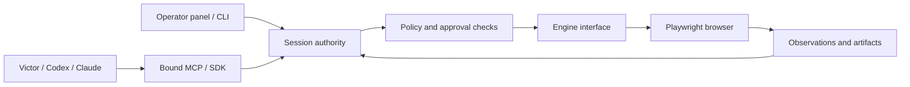

# Delegated sessions: human control and harness interoperability

This opt-in local workflow gives the person and agent an explicit control boundary.
It keeps the existing engine-neutral protocol, TypeScript service, and Playwright
adapter. It adds no UI framework, database, planner, or browser dependency.
Legacy sessions keep their existing behavior.

## Operating the session

Configure an operator API key using the service's existing `AGENTBROWSER_API_KEYS`
setting, then open `/operator` on that service. Use a trusted loopback connection
or HTTPS. The panel keeps the key in tab memory, clears the password input after
connection, and never writes credentials to a URL or browser storage. It uses
explicit bearer headers, no ambient authentication cookies, a restrictive CSP,
and no external scripts. This is a deliberate simplification of the original
cookie-session proposal: no second authentication or CSRF mechanism is needed.

Create a headed session in the panel, or create one through the SDK/CLI with
`controlMode: 'delegated'` and attach its ID. A headed window appears on the
**service host**, not on a remote client's machine. The panel creates sessions
with a one-hour idle timeout; overall TTL still applies. Physical browser input
and status polling do not extend the idle deadline. This milestone uses existing
bounded session expiry rather than a separate handoff timer or durable task store.

1. In `HUMAN_ACTIVE`, choose the application/account and complete private steps in
   the browser. The agent has no valid credential during this period.
2. Select **Prepare fresh review**. This invalidates prior reference revisions and
   captures current page summaries. Inspect the browser itself for account, form,
   and business context: the summary is not an atomic business-state check.
3. Select **Delegate reviewed state**. Copy the returned session token into the
   harness environment outside model-visible tool arguments. Keep the operator
   key private. Any subsequent operator write invalidates the pending review.
4. During `AGENT_ACTIVE`, select **Take over** before interacting. An action
   already sent to the browser can still complete. `PAUSE_REQUESTED` means wait;
   `HUMAN_ACTIVE` means the admitted operation has drained.
5. Review again and issue a new token to resume. Restart/rebind the harness MCP
   process with that token. The old token remains revoked.
6. **Stop session** revokes access and closes the owned session. It cannot undo a
   completed application effect. Reconcile uncertain actions before starting over.

The service coordinates authorized automation; it cannot prevent physical input,
external browser controllers, or autonomous application changes. Do not attach a
second automation writer to this browser outside this authority boundary.

## Shared contracts



| Interface | Authority and behavior |
| --- | --- |
| Session create, `controlMode: 'delegated'` | Operator key required, even when legacy no-key mode is enabled |
| `GET /v1/sessions/{id}/control` | Operator or current session grant; status without browser access |
| `POST .../control/takeover` | Operator; revoke grant immediately and expose drain state |
| `POST .../control/prepare-resume` | Operator; fresh page summaries and review epoch; failure returns to human control |
| `POST .../control/delegate`, `{epoch}` | Operator; new random bearer token, hash retained by server |
| `GET .../operations/{operationId}` | Operator or grant from the operation's generation |
| Existing page operations | One admitted top-level operation per session, including reads; concurrent work gets `SESSION_BUSY` |

State changes are independent of the existing session lifecycle. The engine-neutral
state machine lives in `core`; bearer authentication and request admission live in
`api`. Internal plan steps share their enclosing operation context and recheck it
at browser dispatch. Browser-owned popup registration remains active during human
control; registered popup operations use the same authority guard.

Controlled mutations require `X-AgentBrowser-Operation-Id`: 1–128 ASCII letters,
digits, `_` or `-`. IDs are bound to request digest, control generation, and actor.
The service retains at most 1,000 write records per session, refusing further new
writes instead of evicting IDs and accidentally allowing repeats. It returns
`{replay:true, operation:{...}}` for an identical repeat without dispatching again.
The SDK turns that response into `OPERATION_RECORDED`, not a fabricated action result.

Records expose `in_flight`, `completed`, `failed`, or `outcome_unknown`, plus the
control generation and whether browser dispatch began. `completed` describes
command completion, **not verified application success**. A lost HTTP response
includes its operation ID in SDK errors. Use `sessions.operation()` or
`session operation` to reconcile. There is no automatic write retry, failover,
or exactly-once promise. Records and grants disappear on session close/restart.
This initial record is intentionally small; durable receipts, a completed-plan
prefix, business preconditions, and an evidence timeline remain follow-up work.

Agent access excludes other sessions, session creation/closure, cookie export,
trace export, raw event streams, and control administration. Browser-derived
content events are suppressed during human control/review. Existing captured
artifacts are tagged with the control generation; a later agent grant cannot
fetch a private or previous-generation artifact, including through its signed
URL. API responses use `no-store`. Revocation cannot retract bytes already received.

## SDK, CLI, and MCP

The SDK exposes `control`, `takeover`, `prepareResume`, `delegate`, `operation`,
and `listPages` on `client.sessions`. `createPage`, `navigate`, `executeAction`,
and `plan` accept an optional final `{operationId}` argument. Other mutations
receive generated IDs. Set an explicit ID before a consequential call so a process
crash cannot lose the identifier needed for reconciliation.

CLI example, with operator credentials supplied through the environment:

```sh
agentbrowser --json session create --tenant owner --delegated --no-headless
agentbrowser --json session takeover SESSION_ID
agentbrowser --json session prepare-resume SESSION_ID
agentbrowser --json session delegate SESSION_ID --epoch REVIEW_EPOCH
agentbrowser --json session operation SESSION_ID OPERATION_ID
```

For a **delegated** MCP process set:

```text
AGENTBROWSER_BASE_URL=http://127.0.0.1:5709
AGENTBROWSER_SESSION_ID=<controlled-session-id>
AGENTBROWSER_API_KEY=<delegated-token-from-the-panel>
```

Use the built `packages/mcp-server/dist/bin.js` or a binary built from this change.
Older installed releases do not implement this binding. With a session binding,
`browser_session` discovers current control/pages, and `browser_operation`
reconciles a known operation ID. Session creation/closure and cookie tools are
removed from the catalog. Mutation tools require a caller-chosen `operationId`;
this survives a lost stdio response. A supplied different session ID is refused.
Owner takeover/delegation are never exposed as agent tools.

The same stdio command works with all three harnesses. Registration examples
below use an absolute build path; configure the three environment values above
in the harness's protected MCP settings, not in prompts or checked-in config:

```sh
codex mcp add agentbrowser -- node /absolute/agentbrowser/packages/mcp-server/dist/bin.js
claude mcp add --transport stdio agentbrowser -- node /absolute/agentbrowser/packages/mcp-server/dist/bin.js
victor mcp add --scope project agentbrowser node /absolute/agentbrowser/packages/mcp-server/dist/bin.js
```

Registration describes transport discovery; it is not permission to administer
sessions. Apply the companion Victor response-correlation fix before overlapping
MCP calls. It serializes each stdio connection, ignores notifications/unmatched
responses as tool results, and retires the process after timeout/cancellation.
This deliberately chooses less concurrency over a new multiplexing subsystem.
An official MCP SDK adapter remains the preferred larger conformance evaluation.

## Dependency and product decisions

The review's product hypothesis is continuity of authority and verified outcomes
across human and agent interfaces. Compact browser commands alone are insufficient
differentiation. Compare alternatives on the same tasks and independently measured
application state, not an agent's claims. Sources below were inspected during the
2026-09-14 review; these are candidate choices, not measured competitor rankings.

| Candidate | What it offers | Decision / remaining dependency |
| --- | --- | --- |
| [Playwright MCP](https://github.com/microsoft/playwright-mcp) | Established semantic browser and testing tools | Keep as a baseline; it retains Playwright and browser dependence |
| [Vercel agent-browser](https://github.com/vercel-labs/agent-browser) | Compact agent CLI and direct-CDP execution | Strong distribution/action baseline; CDP remains Chromium-specific |
| [Selenium BiDi](https://www.selenium.dev/documentation/webdriver/bidi/) + Firefox | Different driver and renderer family | Preferred next independence spike, installed without Playwright/Chromium |
| [Puppeteer BiDi](https://pptr.dev/webdriver-bidi) + Firefox | Familiar TypeScript browser API | Alternative spike; qualify observation/accessibility gaps |
| [Chrome DevTools MCP](https://developer.chrome.com/docs/devtools/agents/use-cases/auto-connect) | Existing-browser debugging | Specialist operator tool, coordinated to avoid a second writer |
| [Stagehand](https://docs.stagehand.dev/v3/references/stagehand) / [Browser Use](https://github.com/browser-use/browser-use) | Higher-level browser automation | Benchmark outside core; Victor already owns planning |
| Application-owned APIs/MCP and [WebMCP](https://developer.chrome.com/docs/ai/webmcp/) | Explicit intended operations and business versions | Next parallel execution seam; retain UI parity tests and isolate evolving WebMCP bindings |
| HTTP + HTML extraction | No-browser path for supported static tasks | Useful restricted fallback; cannot count as UI coverage |
| Safari / Obscura | Existing alternate adapters | Safari cannot accept this service's policy-bearing sessions; Obscura remains experimental and Playwright-dependent |
| New renderer, workflow framework, database | Potential future specialization | Not justified for this milestone |

Firefox/WebKit through Playwright diversify renderers but share the driver. A
remote Chromium provider diversifies hosting, not rendering. PDF/CDP capabilities
now report Chromium-only support. No independent browser fallback is delivered
by this change; no automatic switch occurs after an uncertain action.

For owned applications, the next milestone should pair UI operations with typed
application operations and server-enforced versions/idempotency. Verify both
against one outcome oracle, while executing the UI path separately for UI coverage.
For arbitrary websites, fresh refs do not establish atomic business correctness.
Hosted network containment, comprehensive accessibility, durable recovery, and
visual coordinate control retain separate acceptance gates. See the
[threat model](threat-model.md) for existing egress limitations.

## TDD and runner economy

Run `pnpm test:coexistence` locally for one build and the focused state-machine,
API, SDK, CLI, MCP, capability, and real Chromium/panel fixtures. It fails if a
selected workspace package is missing. The real fixture independently records
application effects; a duplicate operation must not increment the counter, and
an old grant/ref must fail after takeover/resume. Deferred-browser tests cover
revoked evidence and stopping the remaining suffix of a plan.

The existing CI Test job discovers these tests automatically. No extra runner or
browser matrix is added. All existing required jobs remain. Dependency installs
use the frozen lockfile; only obsolete PR runs are cancelled by concurrency
control, while integration/release pushes retain separate runs. Validate locally,
then submit one consolidated candidate. Do not use repeated CI attempts as the
implementation loop.

Local red/green results and qualification limits are recorded in the
[validation evidence](evidence/delegated-session-validation.md).
