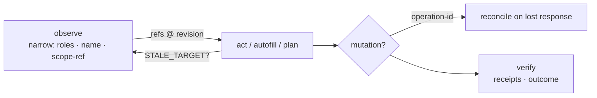

---
hide:
  - navigation
---

# AgentBrowser

**An agent-native browser service.** Agents drive a real Chromium through a
loopback REST service, a TypeScript SDK, a compiled CLI, or an MCP stdio
server — with safety enforced *in the service*, not in the prompt.

> **New in 1.16 — compact observations:** filter by `roles` / `name`, scope to
> a subtree, cap results. **96% fewer bytes** on a 373-element page
> (27.5 KB → 1.0 KB) with every ref still actionable. [CLI for agents →](cli-agent-usage.md#compact-observations-after-1160)

---

## Why it's built this way

| Agents fail by… | AgentBrowser answers with |
| --- | --- |
| Context burned on giant screenshots | Semantic a11y observations, byte/element budgets, **compact projection** |
| Clicking the wrong thing after the page changed | Stable refs (`e<rev>_<ordinal>`) re-checked every action; typed `STALE_TARGET`, never auto-retried |
| Wandering into internal networks | Egress choke point: loopback / private IPs / cloud metadata denied by default |
| One-shot destructive mistakes | Single-use approval tokens bound to session + page revision |
| Cross-tenant leakage | Hashed tenant keys, per-route ownership, ephemeral isolated contexts |

## The loop



| Step | Rule |
| --- | --- |
| **Observe** | Project, don't flood: `--roles dialog --roles checkbox --name policy` echoes `matched N of M` |
| **Act** | Refs only — never selectors. `remap` heals a replaced control (role+name, one candidate) |
| **Mutate** | Fresh `--operation-id` first; reconcile before any retry, never blind-retry |
| **Verify** | Exit 0 ≠ success: read receipts, `outcome`, evidence hashes |

## Quick start

```bash
brew install anvai-labs/tap/agentbrowser
brew services start anvai-labs/tap/agentbrowser
AGENTBROWSER_API_KEYS=key:tenant   # tenant keys (see brew caveats for MCP wiring)
```

```bash
agentbrowser --json health
agentbrowser session create --tenant TENANT
agentbrowser --json observe SESSION PAGE --roles dialog --name policy   # compact
```

## Surfaces

| Surface | Use it when | Docs |
| --- | --- | --- |
| **CLI** (compiled) | Shell agents — primary, token-leanest | [CLI for agents](cli-agent-usage.md) · [Agent skill](https://github.com/anvai-labs/agentbrowser/blob/develop/docs/skills/agentbrowser-cli/SKILL.md) |
| **MCP** (stdio) | Harness-native tool calls | [MCP tool catalog](mcp-tool-catalog.md) |
| **REST / SDK** | Service integration | [Operations](operations.md) |

## Guarantees & honesty

- :material-check-circle: All page content is **untrusted data** — never instructions.
- :material-check-circle: `valueRedacted` means withheld, not empty; redaction is server-side.
- :material-check-circle: No silent fallbacks: engine/policy changes are recorded in responses.
- :material-alert-circle-outline: Egress control is honestly partial — read the
  [threat model](threat-model.md) and the [comparison page](comparison.md).

## Status

- **v1.x shipped**; post-MVP packets [T0–T9](spec/tasks/README.md) — T0/T2/T3 complete, T7 slices 1/2a/3 delivered.
- Every claim is adversarially reviewable via the [evidence index](spec/evidence/t0-foundation.md).
- Defaults (1.16): session TTL **4.4 h**, idle **10 min**, observation window **300 elements**.
