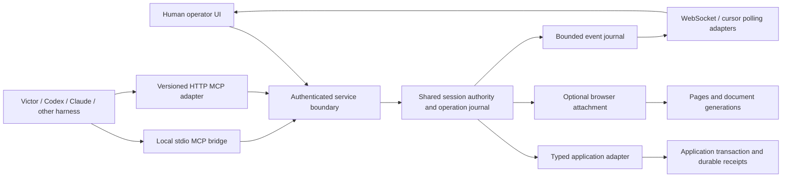

# Shared infrastructure for sessions, pages and agents

Status: proposed next architecture, grounded in the current service and the
application-authority implementation on PR 169. This document does not claim
HTTP MCP, durable recovery, or the event guarantees below are implemented.
Reviewed against source and upstream transport documentation on 2026-09-15.

## Decision

Keep stdio as a compatibility adapter. Make the independently managed service,
reached through authenticated HTTP, the shared owner of logical sessions and
operations. Add versioned MCP Streamable HTTP at that boundary when qualified.
Use the existing WebSocket event adapter initially; add authenticated polling
with cursors as its recovery path. A later SSE adapter must reuse that contract.
Unix-domain sockets and Windows named pipes may optionally carry local service
traffic. Neither is the session model or the default portable public interface.

The existing MCP binary already talks to the service through
`AGENTBROWSER_BASE_URL`; extending this arrangement avoids replacing working
harness integration. Victor currently launches stdio MCP children. Its retirement
fix remains necessary even when a child is only a bridge to the shared service.

| Mechanism | Appropriate use | Limitation and decision |
| --- | --- | --- |
| stdio / anonymous pipes | Harness launches one local MCP bridge; simple process ownership | Parent/child lifetime and inherited handles complicate recovery. Retain compatibility; do not store shared sessions in the bridge. |
| POSIX FIFO / named pipe | Narrow legacy local integration | Byte-stream framing, rendezvous, writer interleaving and permissions need custom machinery; no browser or remote endpoint. Do not use as the common bus. |
| Unix-domain socket / Windows named pipe | Optional local IPC with OS access controls | Platform implementations and browser access differ; Windows named pipes are not POSIX FIFOs. Qualify separately after HTTP behavior is stable. |
| HTTP commands + event subscription/polling | Human UI, multiple harnesses, local service and remote deployment | Authentication, deadlines, buffering and disconnect behavior must be explicit. Default shared boundary. |
| WebSocket | Existing event delivery; future low-latency duplex needs | Requires application flow control and reconnect semantics. Retain the existing adapter; do not move authority into the socket. |
| gRPC / message broker | Future measured throughput or distributed coordination need | Adds client/proxy/deployment obligations. No demonstrated need for another mandatory runtime today. |

This changes control-plane transport only. It does not reopen the deferred browser
network-egress gateway program or claim browser containment.

## Own lifetimes and identities explicitly

| Identity | Owner and lifetime | Recovery rule |
| --- | --- | --- |
| Service instance / generation | Process and its exclusive local store lock | Restart creates a new generation; old grants cannot authorize it. Initially deploy one owner, with no active-active failover. |
| Tenant and authenticated principal | Credential verifier; never a tool-supplied identity | Authenticate each request and authorize subscription deliveries. Connection possession does not confer authority. |
| Logical session | Shared service, explicit TTL and close | Multiple clients may reconnect while it exists. Disconnect does not delete it or extend its TTL. Expiry revokes before cleanup. |
| Control epoch and grant | Existing SessionControl, scoped to principal/session/binding | Reconnect may reuse only an unexpired, currently valid grant; never silently delegate. Takeover/restart/changed binding requires review. |
| Browser attachment and page | Engine adapter, scoped to logical session | Attachment generation fences engine restarts. Page IDs are not URLs or tab indexes. Closing a page does not close sibling pages or the logical session. |
| Document / observation revision | Page adapter | Navigation, reload and replacement invalidate old element references, including same-URL reloads. Reobserve before acting. |
| Connection / JSON-RPC request ID | Individual transport adapter | Correlates one attempt only. A new connection or RPC ID cannot turn an old operation into a new write. |
| Operation ID and business version | Caller plus shared admission; application enforces business version | Persist identity before dispatch; reconcile uncertain work by ID. Business version is independent of control epoch. |
| Event cursor | Service journal generation plus monotonic sequence, authorized session scope | Duplicate events are harmless; gaps require snapshot resynchronization. A cursor is neither a grant nor proof of a committed effect. |

Start with one admitted operation per logical session, shared by browser and
application calls. This preserves the existing authority invariant across pages.
Clients may observe status/events concurrently through explicitly authorized
read-only views; they cannot bypass admission for adapter reads or receipt queries.
Page-level parallel writes require a later resource-conflict model, not another
transport connection. Human edits outside the controlled UI remain governed by
application authorization and version checks; no global human-input lock is claimed.

## Common execution and recovery contract

Transport adapters translate into the same internal command admission. The host
supplies verified principal and cancellation context. Commands identify the
logical session, control epoch, optional page/attachment/revision, stable operation
ID for writes, schema version and validated arguments. Do not expose arbitrary
URLs, executable adapters or credentials as application-tool arguments.

A bounded operation journal records the canonical identity/fingerprint and
admission intent transactionally before external dispatch. Record the dispatch
boundary before issuing the effect. Crash between that record and actual delivery
is conservatively uncertain. Storage failure rejects new writes before dispatch.
Terminal metadata must be committed before reporting a recorded terminal result.
Duplicate identity returns status; changed identity under the same ID conflicts.
A duplicate does not execute again, including after bridge replacement.

Use the existing outcome vocabulary where possible: completed, failed with known
rejection, and outcome_unknown. Transport acknowledgment and control completion
are distinct from an application-verified receipt. The application must atomically
enforce durable idempotency, authorization and expected version with its business
mutation. A local journal cannot create exactly-once external effects.

On transport loss, stop undispatched work when possible and mark dispatched work
uncertain unless durable evidence resolves it. Never automatically replay a write,
fallback from application API to browser click, or return withheld output to a
revoked agent. Cancellation requests stopping; it cannot roll back a commit.
Authorized receipt/status queries are the recovery path, with an independent
application outcome oracle in tests.

On service restart, invalidate all grants, mark incomplete dispatched records
uncertain, and expose an operator recovery view. Old browser handles and DOM refs
are unavailable until a new attachment and observation are qualified. Retained
session metadata is recovery context, not a live browser or restored authority.
Application receipts remain reconcilable under fresh authorization. A resumed
operation must not acquire permission merely by presenting an old operation ID.

Persist minimal metadata with an opt-in local SQLite store behind a small journal
port; keep ephemeral mode available and explicitly weaker. Store hashes and
receipt locators rather than raw form values, credentials or arbitrary tool
results. Retention and redaction apply to events as well. Do not evict duplicate
protection while an operation ID is accepted: reject capacity, or retain bounded
tombstones until session expiry and enforce a documented receipt retention window.
SQLite introduces one optional service dependency; the control package remains
storage-neutral. Multi-host persistence/fencing is a separate qualified adapter.

## Reconnection, events and operator experience

The service starts independently of a particular chat or page. Service installation
owns lifecycle; a bridge validates endpoint identity and readiness before use and
never kills a service it did not launch. Avoid competing auto-start mechanisms in
harnesses. A protected local endpoint descriptor may locate the instance; it must
not embed a long-lived credential or rely solely on a PID that can be reused.

Reconnect uses bounded exponential backoff and jitter for establishment and
idempotent status reads. The UI shows disconnected, resynchronizing, live, or
recovery required. A disconnected UI cannot declare takeover complete. After a
successful takeover acknowledgment it shows the new epoch and any draining or
uncertain operation. No default Retry button for uncertain writes.

For race-free resync, return an authorized snapshot at journal cursor C, then
subscribe/replay events after C. Both transports share the same journal. If C is
outside retention or from another generation, return an explicit resync-required
result and obtain a fresh snapshot. Deduplicate by generation/sequence; order is
per service journal, not a claim of global business-transaction order. Snapshot
contents and cursor must share a consistent boundary. Existing event replay does
not yet establish this contract.

Takeover/grant expiry must stop unauthorized event delivery, including buffered
payloads; authorize before emission, not only at WebSocket upgrade. Provide a
small control-status view for reconciling authority without exposing revoked
page data. Events notify that status changed; receipts establish business outcomes.
Keep credentials out of event URLs. Browser clients can use an authenticated
same-origin session or fetch-based streaming/polling; cookie authentication also
requires CSRF protection. Restrict Origin and Host, bind local listeners to
loopback, and require TLS and scoped authentication for remote use.

Proposed starting bounds, to validate before exposing new endpoints: one active
operation/session; no hidden waiting queue; 64 KiB application command input;
1 MiB maximum event frame with larger artifacts fetched separately; 256 queued
events or 2 MiB per subscriber, whichever comes first; disconnect slow consumers
with resync-required status. Journal retention: 10,000 events or 16 MiB/session,
whichever comes first. Cap sessions, subscribers, total retained bytes and concurrent
requests globally as well (initially 100 sessions, 8 subscribers/session, 256
subscribers total, 256 MiB retained events, 128 concurrent requests). Saturation
rejects before allocation. Advertise effective limits; never silently truncate.
Use existing session TTL and operation deadlines, with a bounded establishment
budget. These values are design defaults, not claims about current enforcement.
Before exposing application commands over HTTP/MCP, enforce the serialized-byte
budget while canonicalizing input, including escaping overhead; checking only
after constructing the whole string permits larger intermediate allocations.

### Resource bounds and lifecycle refinement

The resource-bound implementation hardens the existing in-process boundary before adding
another externally reachable adapter. Canonical application JSON charges UTF-8
bytes, escaping, keys, delimiters, depth and nodes during traversal. It rejects
accessors and sparse arrays instead of executing getters or inventing missing
values. Writes reuse that serialization for their fingerprint; metadata has a
separate bounded serialization so it cannot consume a valid input's depth/node
budget. Reads do not compute unused write fingerprints. This is a resource-bound
and allocation improvement, not a claimed throughput benchmark.

Session registration must not overwrite an active owner. Cleanup detaches its
abort listener and checks the captured owner identity, so an old callback cannot
delete a replacement or revive a grant. Captured page handles also retain their
owner identity. Optional monotonic deadlines are checked at authentication,
admission, dispatch and output; application sessions enable them. Timers trigger
cleanup, but delayed callbacks cannot extend authorization. When capacity is full,
expired sessions are reclaimed before refusing admission. Existing browser
registrations remain signal-driven unless a deadline is supplied.

Missing authority always rejects a guarded call. The browser service explicitly
tracks whether each live session context is delegated using weak identity storage;
absence from the authority map cannot silently select legacy behavior. Event pumps
retain that context identity and recheck it before recording or delivering events,
including between subscribers and for synthetic stream-end events. A takeover
inside one subscriber stops delivery to subsequent subscribers. This closes a
lifecycle gap without a growing session-ID tombstone set; it does not implement
the deferred cursor journal or principal-specific event subscriptions.

The continuity qualification uses two real stdio bridge processes, one independently
managed service and a deterministic engine fixture. It closes one bridge during a
write, verifies duplicate suppression and operation lookup through the other,
reconnects a replacement to both pages, then qualifies takeover and independent
page closure. The receipt here proves a recorded engine command, not a durable
business transaction. Service restart, native page-state restoration, resumable
event cursors and external application tools remain unqualified next slices.

## MCP compatibility is an adapter concern

Current AgentBrowser source advertises `2024-11-05` and uses stdio. Preserve that
working path until a tested negotiation matrix replaces it. Do not change a version
string and claim new protocol support.

The upstream `2026-07-28` Streamable HTTP definition uses request-scoped POST
responses, removes protocol-level sessions and standalone GET event streams, and
does not support Last-Event-ID replay. Earlier `2025-11-25` HTTP semantics differ,
including optional MCP sessions. Therefore service session IDs and event cursors
must be explicit application contracts, independent of either protocol revision.
Cancellation also differs by revision; adapters translate it into bounded stopping
without treating a disconnected write as uncommitted. See the upstream
[2026 HTTP transport source](https://github.com/modelcontextprotocol/modelcontextprotocol/blob/main/docs/specification/2026-07-28/basic/transports/streamable-http.mdx)
and [2025 transport specification](https://modelcontextprotocol.io/specification/2025-11-25/basic/transports).

Choose supported revisions from actual installed harness compatibility tests.
Keep legacy negotiation in the MCP adapter and operation authority in control.
No automatic protocol fallback may resend a mutating tool invocation after uncertain
delivery; negotiate with non-mutating requests first. WebMCP or future agent-native
interfaces may provide additional adapters without becoming the authority owner.

## Delivery and regression gates

| Slice | Repo / seam | Required falsifying tests |
| --- | --- | --- |
| 0: stdio ownership | Victor client and captured transport | Cancellation, inherited blocked read/write, replacement during cleanup, late response, bounded worker count, interpreter exit; never replay a tool. |
| 1: portable authority | AgentBrowser control, PR 169 | App-only execution from extracted production tree with no browser dependencies; shared takeover/admission and duplicate suppression. Implemented in this branch, in-memory only. |
| 2: shared application surfaces | AgentBrowser API/protocol/SDK/MCP/operator UI | REST/SDK/CLI delivered (application capability modes, HTTP oracle); remaining: two separate bridge processes attach to one session; UI/API operation parity; one write wins; wrong tenant, stale grant and wrong resource produce zero effects. |
| 3: reconnect/event contract | AgentBrowser service/event adapters | Disconnect/reconnect without session deletion; gap/duplicate/slow-subscriber/expired-grant cases; snapshot-to-subscription race; same-URL navigation invalidates refs; page A close preserves B. |
| 4: optional durable recovery | AgentBrowser journal plus durable application fixture | Kill before dispatch, after effect but before reply, and during journal update. Restart never replays; revoked grants stay dead; authorized receipt matches independent database state. Disk full/capacity fail closed. |
| 5: HTTP MCP and optional IPC | AgentBrowser transport adapters; Victor HTTP client separately | Pinned revision negotiation, cancellation semantics, two clients, auth/origin tests, bridge replacement, and identical outcomes across adapters. Windows named-pipe/Unix-socket support only after their own platform gates. |

Use deterministic barriers and injected clocks for lifecycle tests; real pipes and
separate processes for the small transport acceptance suite; a real durable
application store for crash receipts. Run targeted suites locally red then green,
plus one extracted-package and one real harness scenario. Reuse existing CI jobs
and caches; map changed transport sources to all affected lifecycle tests. Batch
reviewed changes into a single push. Run the broader required promotion checks
once per final candidate; rerun only when new changes or failures justify it.

Existing behavior and limitations are documented in
[application authority](application-operation-authority.md),
[ephemeral session policy](adr/005-ephemeral-sessions-explicit-persistence.md), and
[the transport integration boundary](transport-integration-contract.md).

Bulk form operations reuse this service admission and transport model; see [bulk autofill](bulk-autofill.md) for the delivered native strategies, cooperative deadline and remaining widget/recovery contracts.
