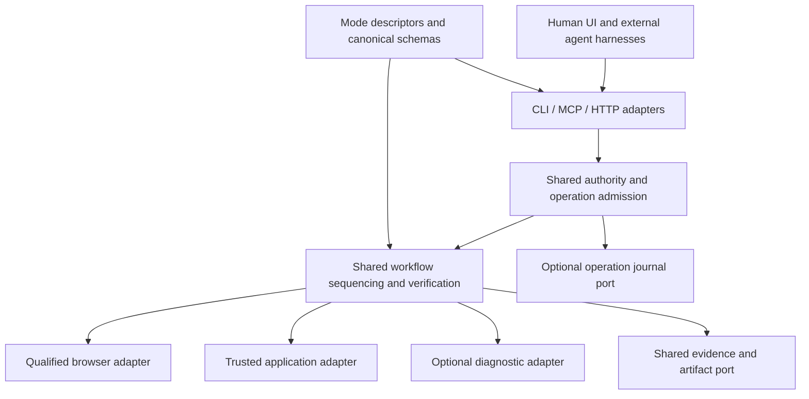

# System architecture and optimal reuse

Status: target architecture with incremental mappings to existing packages.

## Boundary and dependency model

Arrows describe calls/configuration, not permission to create new packages. Begin
inside existing owners. The service owns logical sessions; a bridge owns only its
connection, framing and bounded request correlations. The application owns business
transactions, durable idempotency and business authorization. A browser owns live
documents, never logical authority. The harness owns reasoning, not outcome truth.

## One owner for every concern

| Concern | Existing owner / seam | Extension rule |
| --- | --- | --- |
| Wire primitives, actions and schemas | `packages/protocol/src` | Add versioned contracts once; SDK/UI/MCP consume them |
| Control state machine | `packages/core/src/session-control.ts` | Extend and migrate this machine; do not create mode-specific locks |
| Principal, grant and scoped admission | `packages/control/src/session-authority.ts` | All new adapters enter this boundary |
| Application binding and execution | `packages/control/src/application-authority.ts` | Extend the typed port and its conformance suite |
| Browser contract | `packages/engine/src` | Public ports remain independent of Playwright/CDP objects |
| Browser implementations | Existing `engine-*` packages | Only platform/protocol semantics live here |
| Action risk, approval, secrets, artifacts | Existing core/policy modules | Reuse exact policy and redaction owners |
| Bulk form sequencing | Existing browser-independent autofill orchestrator | Reuse primitives; extract only demonstrated common sequencing |
| HTTP composition | `packages/api/src` | Validate/authorize/translate; remove duplicated domain logic gradually |
| MCP / CLI | Existing adapter packages and TypeScript SDK | Share schemas/results; no parallel business logic |
| Fixtures and conformance | `packages/testkit` and existing scripts | Share fixture builders and assertions, not execution-dependent test oracles |
| Agent planning and model selection | `../codingagent`, Codex, Claude | No mandatory harness dependency in AgentBrowser |

## Common-helper inventory before adding code

| Existing helper / file | Reuse for | Do not misuse as |
| --- | --- | --- |
| `canonicalJson` in control/canonical-json | Bounded application input canonicalization and fingerprint input | Generic raw DOM serializer or a secret anonymizer |
| `decodeWireAction` / `validateWireAction` in protocol/wire-action | One translation/validation path for public action shapes | A new action dispatcher in each client |
| `parseAutofillRequest` / `labelPattern` in protocol/autofill | Native form contract validation and restricted matching | Unrestricted regex or a second form schema |
| `budgetObservation` in core/observation-budget | Final observation envelope/cursor accounting | Proof that native browser capture was bounded before transfer |
| `BoundedCache` in core/bounded-cache | Evictable non-authoritative cache entries | Eviction of still-valid operation deduplication records |
| `SessionControl` / `SessionAuthority` | Admission, epochs, draining and authorized output | A per-mode lock or authority inferred from a connection |
| `defineApplicationOperation` / `ApplicationAuthority` | Trusted typed adapters and scoped application execution | Caller-supplied arbitrary code or destinations |
| Core `SecretManager`, `ArtifactStore`, API artifact-auth | Scoped private values and authorized evidence lifecycle | A global user-memory/profile store |
| API `autofill.ts` | Existing browser-independent form sequencing and strategy seam | Plan-style ordinal remapping for strict block identities |
| SDK `client.ts` request boundary | Timeout classification and no blind mutation retry | Independent retries in every CLI/MCP call site |
| Core tracing/metrics/logger and testkit | Shared telemetry and reusable fixture setup | An independent business outcome oracle derived from execution logs |

File paths in this table are relative to `packages/<owner>/src`. These are reuse
starting points, not a requirement to expose every helper publicly. Inspect existing
signatures and tests before extraction. Keep helpers close to their semantic owner;
no generic `common`, `utils`, `manager` or facade package collecting unrelated concerns.
Share policy and lifecycle, while allowing strategy-specific algorithms to remain local.

## Reuse decision procedure

1. Search for the existing behavior, tests and contract owner before creating code.
2. If only values, allowed operations, limits or reporting differ, add a descriptor
   or mapping consumed by existing code. Reject `if mode === ...` throughout core.
3. If the external protocol or widget semantics differ, add a small adapter/strategy
   implementing an existing port and qualifying positive and negative cases.
4. Extract a shared internal function when two real consumers share the same
   invariant, lifecycle and failure semantics. Do not generalize merely similar syntax.
5. Create a package only for an independently deployable/optional dependency boundary
   or stable cross-package ownership requirement. Record why an internal module fails.
6. Delete superseded paths after compatibility qualification; migrations cannot leave
   two permanent sources of truth. Track any temporary duplication with an exit gate.

Do not merge plan and autofill algorithms blindly: current plan remapping and scoped
autofill have different identity guarantees. Share admission, action execution,
bounded observations, receipt primitives and evidence storage; keep strategy-specific
resolution and commitment predicates explicit. Avoid a universal workflow DSL, plugin
marketplace or dependency-injection framework for seven configuration profiles.

## Deployment compositions

| Composition | Required runtime | Must be absent unless selected |
| --- | --- | --- |
| Harness bridge | Existing MCP adapter or CLI plus service client | Browser binaries, scanners, user-profile database, model SDK |
| Application-only service | Protocol, control and trusted application adapter | Playwright, CDP, browser downloads and rendering processes |
| Local browser service | Shared control plus one installed qualified engine | Other engines and scanner modules |
| QA extension | Browser service plus assertions/report adapters | LLM for deterministic replay; scanner engine |
| Appsec extension | Shared service plus explicitly configured external scanner/proxy | Scanner runtime in default QA/form installation |
| Durable service | Shared service plus optional journal adapter | Mandatory distributed database or broker |

Current package declarations and compiled bundles must be audited separately from
imports executed at startup. Dynamic import saves startup work but does not remove
a transitive installation dependency. Preserve and extend the existing application
and Firefox deployment-independence audits. No claimed footprint improvement without
an isolated install/import/process-tree measurement.

## Performance and concurrency

Start with one service owner and one admitted operation per session. Reuse browser
processes only within qualified tenant/profile isolation boundaries. Separate tabs
are not proof of independent application state, focus or network effects. Parallelize
bounded independent reads; parallel writes require declared resource conflicts and
application-level concurrency control, not DOM-subtree heuristics.

Use existing Maps/WeakMaps for identity and registries, bounded buffers for telemetry,
and sets for dependency closure. Avoid global DOM copies and duplicate native values
in caches. Large artifacts are streamed to scoped storage and fetched on demand.
Backpressure rejects work before allocation; no unbounded hidden queue.

## Alternatives and change triggers

Keep authenticated HTTP as the portable shared-service boundary and stdio as a
compatibility bridge. Add UDS/Windows named-pipe transport only for a measured local
need. No broker or gRPC until throughput/deployment evidence justifies them. A native
Firefox path addresses a different dependency failure than another Chromium driver;
each capability still needs qualification. Typed application tools offer browser-free
execution but cannot substitute for UI coverage. WebMCP is another optional adapter.

The current core/control dependency shape is accepted for this increment. Moving
pure control types to a smaller module is justified only by an import/deployment
audit demonstrating an unwanted runtime dependency, with no duplicate authority API.

## Operability and lifecycle

Reuse existing tracing, metrics and logger infrastructure. Correlate service generation,
run and operation in scoped logs; do not put private values, full URLs with credentials,
or unbounded tenant/run identifiers into metric labels. Track admission rejection,
verification failure/unknown, draining duration, retained bytes and recovery events.
Diagnostic evidence has the same authorization and retention rules as other artifacts.

Readiness advertises the qualified capabilities of the chosen composition; an absent
browser is not an application-only service failure. Shutdown stops admission, revokes
authority, drains within the qualified termination contract, persists uncertainty where
enabled, closes owned adapters and reclaims handles. A timed-out shutdown cannot mark
unknown writes failed-without-effects. Startup validates configuration/schema versions,
store ownership and required capabilities before admitting work.
