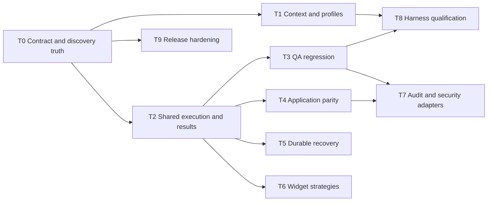

# Implementation order, compatibility and release design

Status: staged work plan. The original delivery was specification only; the subsequent
user instruction activated foundation-first implementation, beginning with T0 discovery.
This document alone grants no commit, push, merge or publication authority. Follow the
current user scope and the [task protocol](tasks/README.md).

## Baseline and proposed delta

| Area | Baseline evidence | Proposed delta |
| --- | --- | --- |
| Shared authority | Core control machine, session/application authority, delegated continuity tests | Common vNext results and qualified durable recovery |
| Native bulk forms | 1.8.19 native, react-select and chip-multiselect strategies, scoped identities and readback | Broader widget/cross-engine and transfer/deadline qualification |
| Application-only path | Typed authority plus bounded authenticated REST/SDK/CLI surface released in 1.8.20 | Production receipt-predicate qualification and binding UX, independent UI/API parity and durable receipt recovery |
| Agent surfaces | CLI and SDK are first-class HTTP clients; stdio MCP remains optional with 13 unbound/12 delegated tools | Generated profiles, typed results and qualified context reduction |
| QA | Browser primitives and strong internal fixtures | Reusable user-facing regression definition/reporting |
| Security | Policy and known engine limitations | Scoped external scanner adapters after enforcement qualification |
| Memory | Ephemeral bounded control state; artifact store | Optional journal and explicit mode-scoped context lifecycle |

## Current progress and gates

| Work | Repository reality | Next evidence gate |
| --- | --- | --- |
| Discovery and profiles | T0 released; T1 local loader, profiles and run cursor released | Installed harness consumes and preserves profile/cursor semantics |
| Shared outcomes | REST/SDK/CLI outcome run released in 1.8.20; correlation, admitted receipt drain and permission composition follow on develop | Qualify UI-caused application evidence through CLI/service and the recovery matrix |
| Bulk forms | Named react-select and chip-multiselect strategies released in 1.8.19 | Broader widgets, reusable mappings and cross-engine commitment evidence |
| Application parity | First T4 public-interface slice released in 1.8.20 by PR #201: application bind, discovery, execute and receipt operations over REST, SDK and CLI | Qualify the scoped receipt predicate in a production fixture, binding UX, independent UI/API parity and T5 durable restart receipts |
| QA and durable runs | Design packets only | Complete their T3 and T5 verticals independently on the shared authority and result contracts |
| Audit, appsec and bounty | Mode contracts and profiles exist; no scanner/product vertical | Scope enforcement plus T3, and T4 for application parity |
| MCP | Existing generated catalog remains 13 unbound/12 delegated in QA; outcome and application operations have no MCP tools | Add only if measured harness demand justifies another optional projection |

## Dependency order

T8 qualifies each delivered increment; it is not a reason to postpone transport
correctness fixes. T9 starts by checking current protection/release state and becomes
a gate for each later release. T7 security work additionally requires independently
qualified scope enforcement. Durable workflows cannot be advertised until T5 passes.

Default execution priority is T0, T1, T2, T3, then T4/T5 as customer demand requires.
T6 addresses concrete blocked widgets. T7 follows actual audit/security demand, not
a speculative full scanner roadmap. T8/T9 accompany delivery. Each task may be split
into reviewable sub-PRs using its declared slices; avoid one giant implementation PR.

## Compatibility and migration

Preserve existing wire operations and outcome semantics while adding optional
versioned result fields or adapters. Add conformance tests before moving shared code.
Remove transitional duplication only after old clients qualify. A smaller profile
must not drop essential operation-recovery or authority information.

One protocol declaration generates schemas/catalog metadata; independently exercise
the actual packaged product to catch missing runtime exports. Keep historical MVP
documents as historical evidence; current capability docs should identify implemented,
qualified and released behavior separately. Update package/docs descriptions with
delivered semantics, including raw artifact privacy and engine-specific limits.

## Per-repository responsibilities

| Repository | Expected future change | Release responsibility |
| --- | --- | --- |
| `agentbrowser` | Shared contracts/helpers, profiles, adapters, tests and docs | Own package/binary/service acceptance and develop/main promotion |
| `../codingagent` | Existing MCP transport/projector, context selection and qualification | Independent tests, PR, CI, promotion and versioning |
| Other harnesses | Configuration/compatibility evidence as applicable | No source-change claim without an actual repository change |

An AgentBrowser release does not imply Victor is released. Record PR/commit/check/
release evidence separately for each repository. Check current branch state and
published artifacts before reporting a version delivered.

## Release and repository hardening

The preceding session enabled main PR/check protection with eight existing GitHub
Actions checks, current-base requirement, conversation resolution, admin enforcement
and force-push/deletion blocks. There is one listed maintainer, so required approvals
were zero. Re-read live settings before execution; this is a historical observation,
not configuration-as-code. Add one independent required reviewer when available.

Release tags need separate protection: verify tag commit ancestry on protected main,
version consistency, required source checks and matching packaged acceptance before
publication. Plan tag creation/update permissions, least-privilege workflow tokens,
dependency/action pinning and secret scanning without breaking trusted publishing.
Do not impose a new signing requirement without a working maintainer/bot signing path.

Promotion protocol: preserve concurrent work; use an isolated branch from current
develop; run local acceptance; commit scoped files; push once ready; open PR; review
and resolve CI; merge by the reviewed head; promote develop to main by PR; release
only the qualified main commit when authorized. Recheck base/head after concurrent
changes. Never force-push another session's branch or use admin bypass to hide failures.

## Stop and recovery conditions

Stop dependent implementation when scope enforcement, external idempotency, protocol
compatibility or target identity cannot meet the declared contract. Continue independent
authorized tasks where possible. Report a specific missing prerequisite, evidence and
next decision. Do not broaden claims, weaken tests or silently substitute interfaces.
Runtime rollback must preserve schema compatibility and uncertain-operation records;
restoring an old binary is not permission to replay writes or erase receipts.
